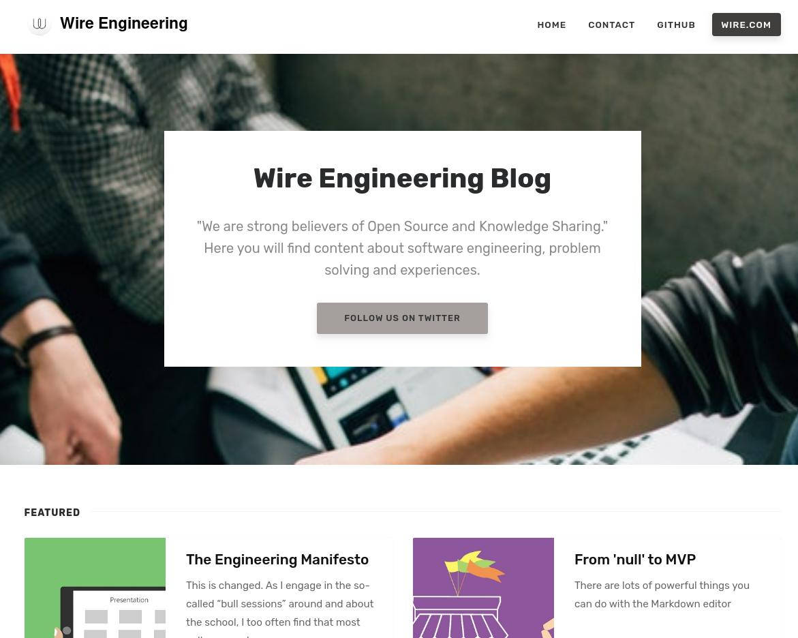

# TODO: Still WIP but functional
 - Email setup: engineers@wire.com (file: _config.yml).
 - Analytics? (file: _config.yml).
 - Disqus for discussions (file: _config.yml).
 - Sharethis for content sharing (file: _config.yml).
 - Polish styles and colors.
 - Setup domain: https://engineering.wire.com/
 - How to contribute section

# "Wire Engineering Blog" - Jekyll Template

[Live Demo](https://engineering.wire.com) &nbsp; | &nbsp; [Download](https://github.com/wireapp/wireapp.github.io/archive/master.zip) &nbsp; |




### Features

- Built for Jekyll
- Compatible with Github pages
- Feed
- Sitemap
- SEO
- Featured Posts
- Index Pagination
- Post Share
- Post Categories
- Prev/Next Link
- Category Archives (this is not yet compatible with github pages though)
- Jumbotron Categories
- Integrations:
    - Disqus Comments
    - Google Analaytics
    - Mailchimp Integration
    - Formspree.io Contact
    - ShareThis Integration
- Design Features:
    - Bootstrap v4.0.0-alpha.6
    - Font Awesome
    - Masonry
- Layouts:
    - Default
    - Post
    - Page
    - Archive
    
### How to Use

If you aren't familiar with Jekyll yet, you should know that it is a static site generator. It will transform your plain text into static websites and blogs. No more databases, slow loading websites, risk of being hacked...just your content. And not only that, with Jekyll you get free hosting with GitHub Pages! This page itself is free hosted on Github with the help of Jekyll and Wire template that you're currently previewing. If you are a beginner we recommend you start with [Jekyll's Docs](https://jekyllrb.com/docs/installation/). Now if you know how to use Jekyll, let's move on to using Wire Engineering Blog template in Jekyll:

### Using this template with Jekyll

- `git clone https://github.com/wireapp/wireapp.github.io`
- `cd wireapp.github.io`
- `bundle`
- Edit `_config.yml`. If your site is in root: `baseurl: ''`. Also, change your Google Analytics code, Disqus username, Authors, Mailchimp, ShareThis code etc.
- `bundler exec jekyll serve --watch`
- Start blogging by adding your .md files in `_posts`. 

- YAML front matter
    - post featured - `featured:true`
    - post featured image - `image: assets/images/mypic.jpg`
    - page comments - `comments:true`
    - meta description (optional) - `description: "this is my meta description"`
    
YAML Post Example:
```
---
layout: post
title:  "Scalability for the win"
author: Fernando Cejas
categories: [ scalability, kotlin ]
image: assets/images/scalability.jpg
featured: true
---
```

YAML Page Example
```
---
layout: page
title: My awesome page
comments: true
---
```

### Copyright

Copyright (C) 2019 Wire.

### Credits

This is a fork from [Affiliates Theme](https://www.wowthemes.net/free-jekyll-template-affiliates/) 

### License

    The MIT License (MIT)

    Copyright (c) 2019 Wire.

    Permission is hereby granted, free of charge, to any person obtaining a copy of this software and 
    associated documentation files (the "Software"), to deal in the Software without restriction, 
    including without limitation the rights to use, copy, modify, merge, publish, distribute, 
    sublicense, and/or sell copies of the Software, and to permit persons to whom the Software is 
    furnished to do so, subject to the following conditions:

    The above copyright notice and this permission notice shall be included in all copies or 
    substantial portions of the Software.

    THE SOFTWARE IS PROVIDED "AS IS", WITHOUT WARRANTY OF ANY KIND, EXPRESS OR IMPLIED, INCLUDING 
    BUT NOT LIMITED TO THE WARRANTIES OF MERCHANTABILITY, FITNESS FOR A PARTICULAR PURPOSE AND 
    NONINFRINGEMENT. IN NO EVENT SHALL THE AUTHORS OR COPYRIGHT HOLDERS BE LIABLE FOR ANY CLAIM, 
    DAMAGES OR OTHER LIABILITY, WHETHER IN AN ACTION OF CONTRACT, TORT OR OTHERWISE, ARISING FROM, 
    OUT OF OR IN CONNECTION WITH THE SOFTWARE OR THE USE OR OTHER DEALINGS IN THE SOFTWARE.

-----------------

### Contribute

1. [Fork the repo](a).
2. Clone a copy of your fork on your local
3. Create a branch off of master and give it a meaningful name (e.g. my-new-cool-feature).
4. Make necessary changes, commit, push and open a pull request on GitHub.

Thank you!
